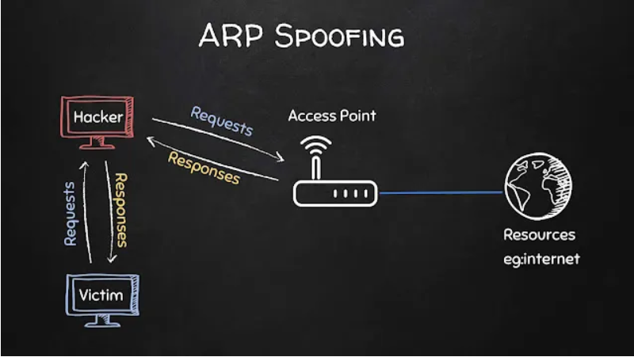
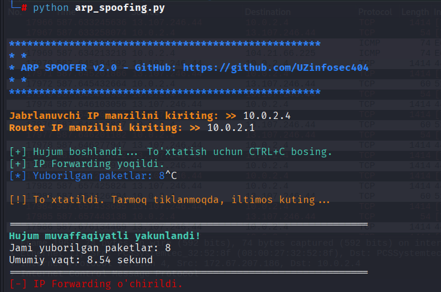
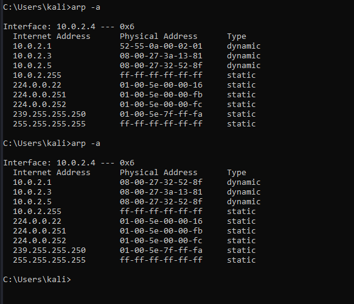

# ARP-spoofing



ARP Spoofer — bu lokal tarmoq (LAN) xavfsizligini o‘rganish va tahlil qilish uchun mo‘ljallangan tarmoq sniffing vositasi. U Address Resolution Protocol (ARP) qanday ishlashini va noto‘g‘ri konfiguratsiya qilingan tarmoqlarda qanday xavflar yuzaga kelishini tushunishga yordam beradi.

ARP — bu tarmoqda IP manzilni jismoniy MAC manzil bilan bog‘lash uchun ishlatiladigan protokol. Qurilmalar o‘zaro aloqa qilayotganda aynan ARP orqali qaysi IP qaysi MAC’ga tegishli ekanini aniqlaydi.

## ARP Spoofing nima?

ARP spoofing — bu tarmoqdagi qurilmalarga soxta ARP javoblari yuborish orqali noto‘g‘ri IP↔MAC bog‘lanishini hosil qilish jarayoni. Natijada tarmoqdagi trafik asl manzil o‘rniga boshqa qurilma orqali o‘tishi mumkin.

Bu usul ko‘pincha Man‑in‑the‑Middle (MITM) ssenariylarini tushuntirishda ishlatiladi. MITM holatida ikki tomon (masalan, foydalanuvchi va router) o‘rtasidagi aloqa uchinchi qurilma orqali o‘tadi.


Ushbu loyiha:

ARP protokolining ishlash mexanizmini tushuntirish

Lokal tarmoqlarda yuzaga keladigan xavfsizlik muammolarini ko‘rsatish

Tarmoq xavfsizligi bo‘yicha ta’limiy va laboratoriya tajribalari uchun mo‘ljallangan

⚠️ Dastur faqat ruxsat etilgan muhitlarda (laboratoriya, test tarmoq) foydalanish uchun yaratilgan.

## Asosiy imkoniyatlar (Features)
🔹 ARP Spoofing

- Tarmoqdagi ARP jarayonini modellashtiradi

- IP va MAC manzillar o‘rtasidagi bog‘lanish qanday buzilishi mumkinligini ko‘rsatadi

🔹 Man‑in‑the‑Middle (MITM) tushunchasi

- Ikki qurilma o‘rtasidagi trafik qanday qilib uchinchi nuqta orqali o‘tishini tushuntiradi

- Tarmoq ishonchliligi nima sababdan muhimligini ko‘rsatadi

🔹 Tarmoq trafikini kuzatish (Monitoring)

- Tarmoqda ma’lumotlar qanday oqishini tahlil qilishga yordam beradi

- Xavfsizlik choralarining samaradorligini baholash uchun ishlatiladi

🔹 Test va Debug muhitlari

- Network administratorlar va talabalar uchun test ssenariylarini yaratish imkonini beradi

- Tarmoq konfiguratsiyalaridagi xatolarni aniqlashga yordam beradi

🔹 Ta’limiy foydalanish

- ARP spoofing hujumlari qanday ishlashini nazariy jihatdan tushuntirish

- Ulardan qanday himoyalanish kerakligini o‘rganish uchun asos yaratadi

---

## Xavfsizlik bo'yicha ogohlantirish 
DIQQAT: Ushbu dastur faqat ta'lim va kiberxavfsizlikni o'rganish maqsadida yaratilgan. 
Uni ruxsat berilmagan tarmoqlarda ishlatish noqonuniy hisoblanadi va javobgarlikka sabab bo'lishi mumkin.

---

## Himoyalanish usullari (Qisqacha)

ARP spoofing hujumlaridan himoyalanish uchun:

- ARP monitoring va detection vositalari

- Tarmoqni to‘g‘ri segmentatsiya qilish

- Shifrlangan protokollar (HTTPS, SSH va boshqalar)

- Xavfsiz tarmoq konfiguratsiyalari

qo‘llaniladi.

---

## Dasturni ishga tushurish 
 Dasturni ishga tushurish uchun sudo huquqi talab qilinadi:
```bash
sudo python3 arp_spoofing.py
```



attack_ip_address = 10.0.2.5

target_ip_address = 10.0.2.4

router_ip_address = 10.0.2.1

Menda target sifatida windows 10 ishlatdim.Dasturni ishga tushurganimdan keyin windowsning ARP javdali rasmdagidek o'zgardi.
Routerning MAC manzili attack kampyuterimning MAC manziliga o'zgardi


